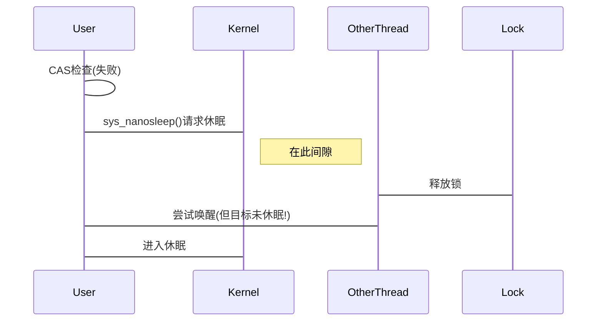

<!-- TOC -->
  * [1. 事件起因](#1-事件起因)
    * [1.1 性能测试](#11-性能测试)
    * [1.2 std::shared_mutex](#12-stdshared_mutex)
    * [1.3 clang::shared_mutex](#13-clangshared_mutex)
    * [1.4 DB::SharedMutex](#14-dbsharedmutex)
  * [2. Futex](#2-futex)
  * [3. 不同读写锁实现探索](#3-不同读写锁实现探索)
    * [3.1 std::shared_mutex(gcc)](#31-stdshared_mutexgcc)
    * [3.2 clang::shared_mutex](#32-clangshared_mutex)
    * [3.3 DB::SharedMutex](#33-dbsharedmutex)
      * [3.3.1 📜 `state` 变量的位布局](#331-state变量的位布局)
      * [3.3.2 🔑 关键实现机制](#332--关键实现机制)
        * [1️⃣ ​ **调用 Futex 完成等待唤醒**​](#1--调用-futex-完成等待唤醒)
        * [2️⃣ ​**写锁获取 (`lock()`)​**​](#2-写锁获取-lock)
        * [3️⃣ ​**读锁获取 (`lock_shared()`)​**​](#3-读锁获取-lock_shared)
        * [4️⃣ ​**解锁优化策略**​](#4-解锁优化策略)
        * [5️⃣ ​**端序兼容处理**​](#5-端序兼容处理)
    * [3.4 pthread_rwlock](#34-pthread_rwlock)
      * [3.4.1 总体设计描述](#341-总体设计描述)
        * [核心设计目标](#核心设计目标)
        * [核心状态机（基于 `__readers` 字段）](#核心状态机基于__readers字段)
          * [状态表](#状态表)
          * [关键状态转移](#关键状态转移)
        * [Futex 同步机制](#futex-同步机制)
          * [优化：避免无效 Futex 调用](#优化避免无效-futex-调用)
        * [内存顺序（Memory Ordering）](#内存顺序memory-ordering)
        * [其他设计要点](#其他设计要点)
        * [术语表](#术语表)
      * [3.4.2 如何实现读优先和写优先](#342-如何实现读优先和写优先)
        * [​**写者优先策略实现**​（PTHREAD_RWLOCK_PREFER_WRITER_NONRECURSIVE_NP）](#写者优先策略实现pthread_rwlock_prefer_writer_nonrecursive_np)
        * [​**读者优先策略实现**​（PTHREAD_RWLOCK_PREFER_READER_NP）](#读者优先策略实现pthread_rwlock_prefer_reader_np)
        * [​**关键移交机制**​（两者通用）](#关键移交机制两者通用)
        * [策略对比摘要](#策略对比摘要)
<!-- TOC -->

## 1. 事件起因

在 clickhouse 源码中发现他自己实现了 [DB::SharedMutex](https://github.com/ClickHouse/ClickHouse/blob/371c7c2e023218b5004a55f1084adb400e8ab64e/src/Common/SharedMutex.h#L15-L43)，而在非 Linux 环境才使用标准库的 `std::shared_mutex`（刚刚查看最新分支代码发现非 Linux 下也使用的 absl 的实现）。而其中自实现的读写锁使用 futex（linux特有的API），这是一个我之前从未听过的名词，我对 futex 以及标准库的 shared_mutex 真的性能这么差吗？感到非常的好奇。于是便有了本篇文章。

有关 futex 是个什么？其全称是 Fast Userspace Mutex，很明显是减少内核陷入次数的同步工具，具体细节请查看 [Futex](#Futex) 。

标准库 shared_mutex 的性能真的有那么差吗？

### 1.1 性能测试

这是我实际测试的对比情况（机器是32核，linux 6.6.80 glibc2.38，均使用 clang-19 -O3 编译）：
测试代码： [source](https://github.com/acking-you/test_shared_mutex/blob/main/main.cpp)

| ​**场景**​      | ​**std::shared_mutex**​ | ​**clang::shared_mutex**​ | ​**DB::SharedMutex**​ | ​**性能领先方**​        |
| ------------- | ----------------------- | ------------------------- | --------------------- | ------------------ |
| ​**64读, 0写**​ | 2,842,706               | 1,270,939                 | ​**3,047,856**​       | 🟢 ​**DB高7.2%​**​  |
| ​**0读, 64写**​ | 29,297                  | 28,479                    | ​**31,901**​          | 🟢 ​**DB高8.9%​**​  |
| ​**64读, 16写** | ​**3,028,239**​         | 730,139                   | 122,343               | 🟡 ​**std高24.7倍**​ |
| ​**16读, 64写** | ​**1,549,032**​         | 73,387                    | 34,014                | 🟡 ​**std高45.5倍**​ |
| ​**64读, 1写**​ | ​**3,029,552**​         | 771,498                   | 3,027,012             | ⚖️ ​**std与DB持平**​  |
| ​**1读, 64写**​ | 30,617                  | 29,291                    | ​**31,969**​          | 🟢 ​**DB高4.4%​**​  |

我本来是只测了标准库中的实现和 ClickHouse 中的 DB::SharedMutex，但测下来发现性能反而是标准库的更好，我记得我看过 clang 的 libcxx 实现，就是一个 mutex+两个 cv +一个 state 变量来实现，按理来说应该是不可能比直接基于 futex+atomic 的 DB::SharedMutex 要好啊。于是我查看该项目索引到的 `std::shared_mutex` 实现，发现不对劲，怎么到了 gcc 的 libcxx 实现了？（我明明用的 llvm19 toolchain，发现是在 llvm 那个目录下既有 clang又有 gcc 的 libcxx）

而 gcc 的 `std::shared_mutex` 实现如下：
```cpp
#if _GLIBCXX_USE_PTHREAD_RWLOCK_T
    typedef void* native_handle_type;
    native_handle_type native_handle() { return _M_impl.native_handle(); }

  private:
    __shared_mutex_pthread _M_impl;
#else
  private:
    __shared_mutex_cv _M_impl;
#endif
  };
#endif // __cpp_lib_shared_mutex
```

在 Linux 下默认会使用 pthread_rwlock ，而不是另一个基于 cv 实现的版本。

虽然不知道基于什么原因，我这个基于 llvm toolchain 的项目使用的是 gcc 的 libcxx，但不妨碍我模拟 clang libcxx 的实现（直接找到 [llvm-project](https://github.com/llvm/llvm-project/blob/main/libcxx/include/shared_mutex#L156-L210) 的源码即可）。
由于直接 copy 对应的文件依赖的头文件太多了，于是直接让 ai 查看源码逻辑生成了一个一样的实现，也放在测试源码的仓库中，测试结果就是上表中的 `clang::shared_mutex`。

果然 clang libcxx 的实现性能是最差的。但我也还是对为什么 ClickHouse 的实现打不过 pthread_rwlock 感到好奇，当然也不是完全打不过，是在有一些写操作的时候会吞吐量会落后，读操作远大于写操作的时候性能会更好。

我怀疑原因如下：
1. pthread_rwlock 是读者优先的（事实证明分析是正确的，详细见下文的探索），所以能做到吞吐量很高（本测试设计的是写操作是读操作的三倍耗时
2. 而 `DB::SharedLock` 则写者优先，若有写者等待则会使得读者也陷入等待，而此时读锁一旦释放根据判断条件只会唤醒写者。

比较有意思的是，也许是发现目前的实现性能非常差 clang 的 libcxx 有个 PR 就是支持基于 `pthread_rwlock_t` 的 `std::shared_mutex`： https://github.com/llvm/llvm-project/pull/148046 ，之前的实现估计考虑到标准库的跨平台，所以简单的基于现有的 cv 实现。

详细测试结果请看下面的内容。
### 1.2 std::shared_mutex

| 场景       | 总操作数      | 读操作数      | 写操作数   | 耗时(ms) | 吞吐量(op/s) |
| -------- | --------- | --------- | ------ | ------ | --------- |
| 64读, 0写  | 5,696,782 | 5,696,782 | 0      | 2004   | 2,842,706 |
| 0读, 64写  | 58,681    | 0         | 58,681 | 2003   | 29,297    |
| 64读, 16写 | 6,080,703 | 6,080,687 | 16     | 2008   | 3,028,239 |
| 16读, 64写 | 3,102,712 | 3,102,647 | 65     | 2003   | 1,549,032 |
| 64读, 1写  | 6,089,400 | 6,089,399 | 1      | 2010   | 3,029,552 |
| 1读, 64写  | 61,326    | 30,631    | 30,695 | 2003   | 30,617    |

### 1.3 clang::shared_mutex

| 场景       | 总操作数      | 读操作数      | 写操作数   | 耗时(ms) | 吞吐量(op/s) |
| -------- | --------- | --------- | ------ | ------ | --------- |
| 64读, 0写  | 2,543,149 | 2,543,149 | 0      | 2001   | 1,270,939 |
| 0读, 64写  | 56,986    | 0         | 56,986 | 2001   | 28,479    |
| 64读, 16写 | 1,461,009 | 1,451,015 | 9,994  | 2001   | 730,139   |
| 16读, 64写 | 146,848   | 105,522   | 41,326 | 2001   | 73,387    |
| 64读, 1写  | 1,543,768 | 1,538,093 | 5,675  | 2001   | 771,498   |
| 1读, 64写  | 58,611    | 3,028     | 55,583 | 2001   | 29,291    |

### 1.4 DB::SharedMutex

| 场景       | 总操作数      | 读操作数      | 写操作数   | 耗时(ms) | 吞吐量(op/s) |
| -------- | --------- | --------- | ------ | ------ | --------- |
| 64读, 0写  | 6,123,143 | 6,123,143 | 0      | 2009   | 3,047,856 |
| 0读, 64写  | 63,865    | 0         | 63,865 | 2002   | 31,901    |
| 64读, 16写 | 244,809   | 210,495   | 34,314 | 2001   | 122,343   |
| 16读, 64写 | 68,131    | 13,733    | 54,398 | 2003   | 34,014    |
| 64读, 1写  | 6,054,023 | 6,053,701 | 322    | 2000   | 3,027,012 |
| 1读, 64写  | 64,002    | 1,024     | 62,978 | 2002   | 31,969    |

## 2. Futex

由于前面的 benchmark，使得我对 `pthread_rwlock` 这个 libc 调用非常好奇，于是查看了相关的源码变动，发现其几乎从最原始的 glibc 版本就已经使用了 futex 。

Futex是一种用户态和内核态混合的同步机制，通过在用户空间中存入一个 futex 状态变量，当线程或进程（需要通过 mmap 共享 futex 内存）尝试进入互斥区或者退出互斥区的时候，1. 先去查看共享内存中的futex变量（原子操作 CAS），如果没有竞争发生，则只修改futex，而不用再陷入内核等待。 2.仅当通过访问futex变量告诉进程有竞争发生时，才执行系统调用去完成相应的处理。

与上述能力有关的调用就下面两个：
```
// futex_word 指向futex状态变量，expcted 代表这个地址期待的值，当*futex_word==expected 时，才会进行wait
int futex_wait (unsigned int *futex_word, unsigned int expected, int private);


// 唤醒 processes_to_wake 个在 futex_word 指向的锁变量上挂起等待的进程
void futex_wake (unsigned int* futex_word, int processes_to_wake, int private);

// 上述 private 字段与共享内存有关，可以查看相关源码注释
```


有关 glibc 的 futex 详细实现介绍可以查看这个注释 [glibc-2.22](https://elixir.bootlin.com/glibc/glibc-2.22/source/sysdeps/nptl/futex-internal.h#L28-L66)。

根据 glibc 2.22 的 changelog 可知统一了glibc 内部使用的futexes在上述链接的文件中。
```
* Handle private futexes in the NPTL implementation.
  Implemented by Jakub Jelinek and Ulrich Drepper.
```

而 glibc 实际并不暴露 futex 的 wrapper 供用户使用，可以查看 man 文档，通过 syscall 完成调用： https://man7.org/linux/man-pages/man2/futex.2.html

有关 futex 调用的具体实践，可以查看 `DB::SharedMutex` 一节中的代码实现。

为什么需要专门的 futex 原语，而不是让开发者手动组合原子操作和系统调用？

下面是 deepseek 的回答：
原子性缺口：内核态无法保障的用户态检查
​**致命的时间窗问题：​**​



- ​**问题**​：在 CAS 失败后调用休眠系统调用的间隙，锁可能被释放，唤醒信号在此间隙发生
- ​**后果**​：永久性休眠（信号丢失）或无限延迟唤醒

​**futex 解决方案：​**​

```c
// 内核保证的原子检查+阻塞
if (*(futex_word) == expected_val) {
    add_to_wait_queue();
    schedule(); // 只有值匹配才阻塞
}
```

内核在**单次系统调用**中完成"检查值+阻塞"，消除了时间窗风险

当 Linus Torvalds 设计 futex 时说：

> "The futex is designed to be a building block for user-space locking - small, fast, and primitive."

它本质上是将用户态的并发意图​（检查什么值？如何阻塞？）与内核态的实现能力​（如何安全阻塞？怎么唤醒？）通过最小接口连接，这正是其精妙之处——不像传统系统调用那样做全部工作，也不像纯用户态那样无法正确实现。

这就是为什么30年后，futex 依然是 Linux 同步原语的基石：它找到了用户态灵活性内核态能力的最佳平衡点。

## 3. 不同读写锁实现探索

### 3.1 std::shared_mutex(gcc)

[source code](https://github.com/gcc-mirror/gcc/blob/master/libstdc%2B%2B-v3/include/std/shared_mutex#L416-L447)

在不支持 pthread_rwlock 的平台下实现如下（与目前的 clang 实现一样，但可读性更好（位运算更少））：

```cpp
 /// A shared mutex type implemented using std::condition_variable.
  class __shared_mutex_cv
  {
    friend class shared_timed_mutex;

    // Based on Howard Hinnant's reference implementation from N2406.

    // The high bit of _M_state is the write-entered flag which is set to
    // indicate a writer has taken the lock or is queuing to take the lock.
    // The remaining bits are the count of reader locks.
    //
    // To take a reader lock, block on gate1 while the write-entered flag is
    // set or the maximum number of reader locks is held, then increment the
    // reader lock count.
    // To release, decrement the count, then if the write-entered flag is set
    // and the count is zero then signal gate2 to wake a queued writer,
    // otherwise if the maximum number of reader locks was held signal gate1
    // to wake a reader.
    //
    // To take a writer lock, block on gate1 while the write-entered flag is
    // set, then set the write-entered flag to start queueing, then block on
    // gate2 while the number of reader locks is non-zero.
    // To release, unset the write-entered flag and signal gate1 to wake all
    // blocked readers and writers.
    //
    // This means that when no reader locks are held readers and writers get
    // equal priority. When one or more reader locks is held a writer gets
    // priority and no more reader locks can be taken while the writer is
    // queued.

    // Only locked when accessing _M_state or waiting on condition variables.
    mutex		_M_mut;
    // Used to block while write-entered is set or reader count at maximum.
    condition_variable	_M_gate1;
    // Used to block queued writers while reader count is non-zero.
    condition_variable	_M_gate2;
    // The write-entered flag and reader count.
    unsigned		_M_state;

    static constexpr unsigned _S_write_entered
      = 1U << (sizeof(unsigned)*__CHAR_BIT__ - 1);
    static constexpr unsigned _S_max_readers = ~_S_write_entered;

    // Test whether the write-entered flag is set. _M_mut must be locked.
    bool _M_write_entered() const { return _M_state & _S_write_entered; }

    // The number of reader locks currently held. _M_mut must be locked.
    unsigned _M_readers() const { return _M_state & _S_max_readers; }

  public:
    __shared_mutex_cv() : _M_state(0) {}

    ~__shared_mutex_cv()
    {
      __glibcxx_assert( _M_state == 0 );
    }

    __shared_mutex_cv(const __shared_mutex_cv&) = delete;
    __shared_mutex_cv& operator=(const __shared_mutex_cv&) = delete;

    // Exclusive ownership

    void
    lock()
    {
      unique_lock<mutex> __lk(_M_mut);
      // Wait until we can set the write-entered flag.
      _M_gate1.wait(__lk, [this]{ return !_M_write_entered(); });
      _M_state |= _S_write_entered;
      // Then wait until there are no more readers.
      _M_gate2.wait(__lk, [this]{ return _M_readers() == 0; });
    }

    bool
    try_lock()
    {
      unique_lock<mutex> __lk(_M_mut, try_to_lock);
      if (__lk.owns_lock() && _M_state == 0)
	{
	  _M_state = _S_write_entered;
	  return true;
	}
      return false;
    }

    void
    unlock()
    {
      lock_guard<mutex> __lk(_M_mut);
      __glibcxx_assert( _M_write_entered() );
      _M_state = 0;
      // call notify_all() while mutex is held so that another thread can't
      // lock and unlock the mutex then destroy *this before we make the call.
      _M_gate1.notify_all();
    }

    // Shared ownership

    void
    lock_shared()
    {
      unique_lock<mutex> __lk(_M_mut);
      _M_gate1.wait(__lk, [this]{ return _M_state < _S_max_readers; });
      ++_M_state;
    }

    bool
    try_lock_shared()
    {
      unique_lock<mutex> __lk(_M_mut, try_to_lock);
      if (!__lk.owns_lock())
	return false;
      if (_M_state < _S_max_readers)
	{
	  ++_M_state;
	  return true;
	}
      return false;
    }

    void
    unlock_shared()
    {
      lock_guard<mutex> __lk(_M_mut);
      __glibcxx_assert( _M_readers() > 0 );
      auto __prev = _M_state--;
      if (_M_write_entered())
	{
	  // Wake the queued writer if there are no more readers.
	  if (_M_readers() == 0)
	    _M_gate2.notify_one();
	  // No need to notify gate1 because we give priority to the queued
	  // writer, and that writer will eventually notify gate1 after it
	  // clears the write-entered flag.
	}
      else
	{
	  // Wake any thread that was blocked on reader overflow.
	  if (__prev == _S_max_readers)
	    _M_gate1.notify_one();
	}
    }
  };
#endif
```

clang的 shared_mutex就是上述实现方式，只不过 gcc 还单独对支持 pthread_rwlock的平台使用了另一套实现。

上述实现方式三个关键点：
1. 用 unsigned 的最高位表示当前是否有 writer 抢占读写锁，其他低位表示读者的数量。
2. 用 gate1 和 gate2 两个 cv 分别用来等待独占的写 flag 和是否有读者。
3. 实现整体上是写者优先，具体表现在 lock 动作通过两个 cv 条件分开，unlock_shared时一旦有写者存在且当前是最后一个读者则会唤醒写者。

### 3.2 clang::shared_mutex

clang 的 shared_mutex 实现目前就和前面 `std::shared_mutex(gcc)` 一节分享的实现一模一样。

具体源码链接：
[shared_mutex.h](https://github.com/llvm/llvm-project/blob/llvmorg-20.1.8/libcxx/include/shared_mutex#L156-L183)
[shared_mutex.cpp](https://github.com/llvm/llvm-project/blob/llvmorg-20.1.8/libcxx/src/shared_mutex.cpp)

clang 也在尝试集成 pthread_rwlock 的实现：
https://github.com/llvm/llvm-project/pull/148046

### 3.3 DB::SharedMutex

ClickHouse 的 SharedMutex 是一个非常好的 futex 运用的案例，因为其代码非常简单易懂，类似的其他运用 futex 实现的 SharedMutex 还有 folly 的实现，但是那个代码实现相比会复杂很多（粗略看了下似乎还通过 slot 减少了 CAS 的次数）。

摘取关键代码如下：
```cpp
    // Faster implementation of `std::shared_mutex` based on a pair of futexes
    class SharedMutex {
		...
        static constexpr uint64_t readers = (1ull << 32ull) - 1ull; // Lower 32 bits of state
        static constexpr uint64_t writers = ~readers; // Upper 32 bits of state

        alignas(64) std::atomic<uint64_t> state;
        std::atomic<uint32_t> waiters;
    };

namespace DB {
    namespace {
        inline int64_t futexWait(void *address, uint32_t value) {
            return syscall(SYS_futex, address, FUTEX_WAIT_PRIVATE, value, nullptr, nullptr, 0);
        }

        inline int64_t futexWake(void *address, int count) {
            return syscall(SYS_futex, address, FUTEX_WAKE_PRIVATE, count, nullptr, nullptr, 0);
        }

        inline constexpr uint32_t lowerHalf(uint64_t value) { return static_cast<uint32_t>(value & 0xffffffffull); }

        inline constexpr uint32_t upperHalf(uint64_t value) { return static_cast<uint32_t>(value >> 32ull); }


        inline uint32_t *upperHalfAddress(void *address) {
            return reinterpret_cast<uint32_t *>(address) + (std::endian::native == std::endian::little);
        }

        inline uint32_t *lowerHalfAddress(void *address) {
            return reinterpret_cast<uint32_t *>(address) + (std::endian::native == std::endian::big);
        }

        inline void futexWaitUpperFetch(std::atomic<uint64_t> &address, uint64_t &value) {
            futexWait(upperHalfAddress(&address), upperHalf(value));
            value = address.load();
        }

        inline void futexWaitLowerFetch(std::atomic<uint64_t> &address, uint64_t &value) {
            futexWait(lowerHalfAddress(&address), lowerHalf(value));
            value = address.load();
        }

        inline void futexWakeUpperAll(std::atomic<uint64_t> &address) {
            futexWake(upperHalfAddress(&address), INT_MAX);
        }

        inline void futexWakeLowerOne(std::atomic<uint64_t> &address) { futexWake(lowerHalfAddress(&address), 1); }
    } // namespace

    SharedMutex::SharedMutex() : state(0), waiters(0) {}

    void SharedMutex::lock() {
        uint64_t value = state.load();
        while (true) {
            if (value & writers) {
                waiters++;
                futexWaitUpperFetch(state, value);
                waiters--;
            } else if (state.compare_exchange_strong(value, value | writers))
                break;
        }

        value |= writers;
        while (value & readers)
            futexWaitLowerFetch(state, value);
    }

    bool SharedMutex::try_lock() {
        uint64_t value = 0;
        return state.compare_exchange_strong(value, writers);
    }

    void SharedMutex::unlock() {
        state.store(0);
        if (waiters)
            futexWakeUpperAll(state);
    }

    void SharedMutex::lock_shared() {
        uint64_t value = state.load();
        while (true) {
            if (value & writers) {
                waiters++;
                futexWaitUpperFetch(state, value);
                waiters--;
            } else if (state.compare_exchange_strong(value, value + 1))
                break;
        }
    }

    bool SharedMutex::try_lock_shared() {
        uint64_t value = state.load();
        while (true) {
            if (value & writers)
                return false;
            if (state.compare_exchange_strong(value, value + 1))
                break;
            // Concurrent try_lock_shared() should not fail, so we have to retry CAS, but avoid blocking wait
        }
        return true;
    }

    void SharedMutex::unlock_shared() {
        uint64_t value = state.fetch_sub(1) - 1;
        if (value == writers)
            futexWakeLowerOne(state); // Wake writer
    }

}
```


#### 3.3.1 📜 `state` 变量的位布局

```markdown
+-------------------------------+-------------------------------+
|         高 32 位 (63-32)       |         低 32 位 (31-0)        |
+-------------------------------+-------------------------------+
|          Writers 区域          |          Readers 区域          |
+-------------------------------+-------------------------------+
```

- ​ **`Writers` 区域**​ (高 32 位)
    - ​**全置 1 (`0xFFFFFFFF`)​**​：表示有写锁正在持有或等待（独占模式）
    - ​**全 0**​：表示无写锁（通过 `writers = ~readers` 计算，值为 `0xFFFFFFFF00000000`）
- ​ **`Readers` 区域**​ (低 32 位)
    - ​**计数值**​：记录当前持有读锁的数量（共享模式）

至于这里为什么不用 1bit 表示是否有写者，我猜应该是本来就需要 64 字节对齐缓存行，避免浪费这部分字节吧（不然可以更精简的用 uint32_t）

#### 3.3.2 🔑 关键实现机制

##### 1️⃣ ​ **调用 Futex 完成等待唤醒**​

```cpp
alignas(64) std::atomic<uint64_t> state;  // 确保缓存行对齐
std::atomic<uint32_t> waiters;             // 高区域等待者计数
```

- ​**分离高低 32 位**​：通过 `futexWaitUpper()` 和 `futexWaitLower()` 分别等待高低位变化
- ​**唤醒优化**​：
    - `unlock()` → 唤醒 _所有_ 高区域等待者（`futexWakeUpperAll()`）
    - `unlock_shared()` → 唤醒 _一个_ 低区域等待者（`futexWakeLowerOne()`）

##### 2️⃣ ​**写锁获取 (`lock()`)​**​

```cpp
while (true) {
  if (value & writers) {  // 🔒 已有写锁
    waiters++;            // 注册为高区域等待者
    futexWaitUpperFetch(state, value); // 阻塞
    waiters--;
  } 
  else if (CAS(value, value | writers)) break; // ✅ 成功设置写锁标志
}
while (value & readers) {  // 等待所有读锁释放
  futexWaitLowerFetch(state, value);
}
```

- ​**两步获取**​：
    1. CAS 设置高 32 位为全 1（阻塞新读者/写者）
    2. 循环等待低 32 位归零（现有读者释放）

##### 3️⃣ ​**读锁获取 (`lock_shared()`)​**​

```cpp
while (true) {
  if (value & writers) {  // 🔒 有写锁存在
    waiters++; 
    futexWaitUpperFetch(state, value); // 等待写锁释放
    waiters--;
  } 
  else if (CAS(value, value + 1)) break; // ✅ 读计数+1
}
```

- ​**写锁优先**​：检测到高区域非零时阻塞（避免写锁饥饿）

##### 4️⃣ ​**解锁优化策略**​

| 方法                | 行为                                            |
| ----------------- | --------------------------------------------- |
| `unlock()`        | `state=0` + 唤醒所有高区域等待者（读/写线程）                 |
| `unlock_shared()` | 读计数减 1，若 `value == writers`（即读归零且写等待）→ 唤醒一个写者 |
这个思路和前面提到的 `shared_mutex` 实现是一样的，同样的写者优先，但使用了 futex 做了性能优化。
##### 5️⃣ ​**端序兼容处理**​

```cpp
inline uint32_t* upperHalfAddress(void* addr) {
  return reinterpret_cast<uint32_t*>(addr) + (std::endian::native == std::endian::little);
}
```

- 自动适配大小端架构（低地址存放低/高位）
### 3.4 pthread_rwlock

[pthread_rwlock_common(glibc2.25)](https://elixir.bootlin.com/glibc/glibc-2.25/source/nptl/pthread_rwlock_common.c#L29-L214)
有关 [changelog](https://abi-laboratory.pro/?view=changelog&l=glibc&v=2.25) 如下：
```
* A new version of pthread_rwlock functions have been implemented to use a more
  scalable algorithm primarily through not using a critical section anymore to
  make state changes.
```

以下为注释中的有关 pthread_rwlock 的设计描述，其中有提到 pthread_rwlock 支持指定读优先或写优先，而默认是读优先（这也能解释前面的 benchmark 结果了）：
```
/* A reader--writer lock that fulfills the POSIX requirements (but operations
   on this lock are not necessarily full barriers, as one may interpret the   POSIX requirement about "synchronizing memory").  All critical sections are   in a total order, writers synchronize with prior writers and readers, and   readers synchronize with prior writers.
   A thread is allowed to acquire a read lock recursively (i.e., have rdlock   critical sections that overlap in sequenced-before) unless the kind of the   rwlock is set to PTHREAD_RWLOCK_PREFER_WRITERS_NONRECURSIVE_NP.
   This lock is built so that workloads of mostly readers can be executed with   low runtime overheads.  This matches that the default kind of the lock is   PTHREAD_RWLOCK_PREFER_READER_NP.  Acquiring a read lock requires a single   atomic addition if the lock is or was previously acquired by other   readers; releasing the lock is a single CAS if there are no concurrent   writers.   Workloads consisting of mostly writers are of secondary importance.   An uncontended write lock acquisition is as fast as for a normal   exclusive mutex but writer contention is somewhat more costly due to   keeping track of the exact number of writers.  If the rwlock kind requests   writers to be preferred (i.e., PTHREAD_RWLOCK_PREFER_WRITERS_NP or the   no-recursive-readers variant of it), then writer--to--writer lock ownership   hand-over is fairly fast and bypasses lock acquisition attempts by readers.   The costs of lock ownership transfer between readers and writers vary.  If   the program asserts that there are no recursive readers and writers are   preferred, then write lock acquisition attempts will block subsequent read   lock acquisition attempts, so that new incoming readers do not prolong a   phase in which readers have acquired the lock.
   The main components of the rwlock are a writer-only lock that allows only   one of the concurrent writers to be the primary writer, and a   single-writer-multiple-readers lock that decides between read phases, in   which readers have acquired the rwlock, and write phases in which a primary   writer or a sequence of different primary writers have acquired the rwlock.
   The single-writer-multiple-readers lock is the central piece of state   describing the rwlock and is encoded in the __readers field (see below for   a detailed explanation):
   State WP  WL  R   RW  Notes   ---------------------------   #1    0   0   0   0   Lock is idle (and in a read phase).   #2    0   0   >0  0   Readers have acquired the lock.   #3    0   1   0   0   Lock is not acquired; a writer is waiting for a write
			 phase to start or will try to start one.   #4    0   1   >0  0   Readers have acquired the lock; a writer is waiting
			 and explicit hand-over to the writer is required.   #4a   0   1   >0  1   Same as #4 except that there are further readers
			 waiting because the writer is to be preferred.   #5    1   0   0   0   Lock is idle (and in a write phase).   #6    1   0   >0  0   Write phase; readers are waiting for a read phase to
			 start or will try to start one.   #7    1   1   0   0   Lock is acquired by a writer.   #8    1   1   >0  0   Lock acquired by a writer and readers are waiting;
			 explicit hand-over to the readers is required.
   WP (PTHREAD_RWLOCK_WRPHASE) is true if the lock is in a write phase, so   potentially acquired by a primary writer.   WL (PTHREAD_RWLOCK_WRLOCKED) is true if there is a primary writer (i.e.,   the thread that was able to set this bit from false to true).   R (all bits in __readers except the number of least-significant bits   denoted in PTHREAD_RWLOCK_READER_SHIFT) is the number of readers that have   or are trying to acquired the lock.  There may be more readers waiting if   writers are preferred and there will be no recursive readers, in which   case RW (PTHREAD_RWLOCK_RWAITING) is true in state #4a.
   We want to block using futexes but using __readers as a futex word directly   is not a good solution.  First, we want to wait on different conditions   such as waiting for a phase change vs. waiting for the primary writer to   release the writer-only lock.  Second, the number of readers could change   frequently, which would make it likely that a writer's futex_wait fails   frequently too because the expected value does not match the value of   __readers anymore.   Therefore, we split out the futex words into the __wrphase_futex and   __writers_futex fields.  The former tracks the value of the WP bit and is   changed after changing WP by the thread that changes WP.  However, because   of the POSIX requirements regarding mutex/rwlock destruction (i.e., that   destroying a rwlock is allowed as soon as no thread has acquired or will   acquire the lock), we have to be careful and hand over lock ownership (via   a phase change) carefully to those threads waiting.  Specifically, we must   prevent a situation in which we are not quite sure whether we still have   to unblock another thread through a change to memory (executing a   futex_wake on a former futex word that is now used for something else is   fine).   The scheme we use for __wrphase_futex is that waiting threads that may   use the futex word to block now all have to use the futex word to block; it   is not allowed to take the short-cut and spin-wait on __readers because   then the waking thread cannot just make one final change to memory to   unblock all potentially waiting threads.  If, for example, a reader   increments R in states #7 or #8, it has to then block until __wrphase_futex   is 0 and it can confirm that the value of 0 was stored by the primary   writer; in turn, the primary writer has to change to a read phase too when   releasing WL (i.e., to state #2), and it must change __wrphase_futex to 0   as the next step.  This ensures that the waiting reader will not be able to   acquire, release, and then destroy the lock concurrently with the pending   futex unblock operations by the former primary writer.  This scheme is   called explicit hand-over in what follows.   Note that waiting threads can cancel waiting only if explicit hand-over has   not yet started (e.g., if __readers is still in states #7 or #8 in the   example above).
   Writers determine the primary writer through WL.  Blocking using futexes   is performed using __writers_futex as a futex word; primary writers will   enable waiting on this futex by setting it to 1 after they acquired the WL   bit and will disable waiting by setting it to 0 before they release WL.   This leaves small windows where blocking using futexes is not possible   although a primary writer exists, but in turn decreases complexity of the   writer--writer synchronization and does not affect correctness.   If writers are preferred, writers can hand over WL directly to other   waiting writers that registered by incrementing __writers:  If the primary   writer can CAS __writers from a non-zero value to the same value with the   PTHREAD_RWLOCK_WRHANDOVER bit set, it effectively transfers WL ownership   to one of the registered waiting writers and does not reset WL; in turn,   a registered writer that can clear PTHREAD_RWLOCK_WRHANDOVER using a CAS   then takes over WL.  Note that registered waiting writers can cancel   waiting by decrementing __writers, but the last writer to unregister must   become the primary writer if PTHREAD_RWLOCK_WRHANDOVER is set.   Also note that adding another state/bit to signal potential writer--writer   contention (e.g., as done in the normal mutex algorithm) would not be   helpful because we would have to conservatively assume that there is in   fact no other writer, and wake up readers too.
   To avoid having to call futex_wake when no thread uses __wrphase_futex or   __writers_futex, threads will set the PTHREAD_RWLOCK_FUTEX_USED bit in the   respective futex words before waiting on it (using a CAS so it will only be   set if in a state in which waiting would be possible).  In the case of   __writers_futex, we wake only one thread but several threads may share   PTHREAD_RWLOCK_FUTEX_USED, so we must assume that there are still others.   This is similar to what we do in pthread_mutex_lock.  We do not need to   do this for __wrphase_futex because there, we always wake all waiting   threads.
   Blocking in the state #4a simply uses __readers as futex word.  This   simplifies the algorithm but suffers from some of the drawbacks discussed   before, though not to the same extent because R can only decrease in this   state, so the number of potentially failing futex_wait attempts will be   bounded.  All threads moving from state #4a to another state must wake   up threads blocked on the __readers futex.
   The ordering invariants that we have to take care of in the implementation   are primarily those necessary for a reader--writer lock; this is rather   straightforward and happens during write/read phase switching (potentially   through explicit hand-over), and between writers through synchronization   involving the PTHREAD_RWLOCK_WRLOCKED or PTHREAD_RWLOCK_WRHANDOVER bits.   Additionally, we need to take care that modifications of __writers_futex   and __wrphase_futex (e.g., by otherwise unordered readers) take place in   the writer critical sections or read/write phases, respectively, and that   explicit hand-over observes stores from the previous phase.  How this is   done is explained in more detail in comments in the code.
   Many of the accesses to the futex words just need relaxed MO.  This is   possible because we essentially drive both the core rwlock synchronization   and the futex synchronization in parallel.  For example, an unlock will   unlock the rwlock and take part in the futex synchronization (using   PTHREAD_RWLOCK_FUTEX_USED, see above); even if they are not tightly   ordered in some way, the futex synchronization ensures that there are no   lost wake-ups, and woken threads will then eventually see the most recent   state of the rwlock.  IOW, waiting threads will always be woken up, while   not being able to wait using futexes (which can happen) is harmless; in   turn, this means that waiting threads don't need special ordering wrt.   waking threads.
   The futex synchronization consists of the three-state futex word:   (1) cannot block on it, (2) can block on it, and (3) there might be a   thread blocked on it (i.e., with PTHREAD_RWLOCK_FUTEX_USED set).   Relaxed-MO atomic read-modify-write operations are sufficient to maintain   this (e.g., using a CAS to go from (2) to (3) but not from (1) to (3)),   but we need ordering of the futex word modifications by the waking threads   so that they collectively make correct state changes between (1)-(3).   The futex-internal synchronization (i.e., the conceptual critical sections   around futex operations in the kernel) then ensures that even an   unconstrained load (i.e., relaxed MO) inside of futex_wait will not lead to   lost wake-ups because either the waiting thread will see the change from   (3) to (1) when a futex_wake came first, or this futex_wake will wake this   waiting thread because the waiting thread came first.
   POSIX allows but does not require rwlock acquisitions to be a cancellation   point.  We do not support cancellation.
   TODO We do not try to elide any read or write lock acquisitions currently.   While this would be possible, it is unclear whether HTM performance is   currently predictable enough and our runtime tuning is good enough at   deciding when to use elision so that enabling it would lead to consistently   better performance.  */
```


#### 3.4.1 总体设计描述

使用 AI 对整体设计描述做了总结。

该文件是 ​**glibc 库**中 POSIX 读写锁（reader-writer lock）的核心实现代码。读写锁允许多个线程同时读取共享资源，但写入时需要独占访问，适用于读多写少的场景。

---
##### 核心设计目标

1. ​**POSIX 兼容性**:
    - 满足 POSIX 标准对内存同步的要求（临界区操作是内存屏障）。
    - 所有临界区操作**全序化**​：写操作与之前的写/读操作同步，读操作与之前的写操作同步。
2. ​**性能优化**:
    - ​**读优先**​：默认模式（`PTHREAD_RWLOCK_PREFER_READER_NP`）下，无竞争时：
        - ​**获取读锁**​：仅需一个原子加法指令。
        - ​**释放读锁**​：若无私锁，仅需一个 CAS 指令。
    - ​**写优先**​（`PTHREAD_RWLOCK_PREFER_WRITER_NP`）：
        - 写入者可直接移交锁所有权，绕过读请求。
        - 避免读锁递归（防止读者长期占用锁）。

---
##### 核心状态机（基于 `__readers` 字段）

读写锁状态通过位掩码 `__readers` 表示，包含以下标志位：

- ​**WP（写阶段标志）​**​：`PTHREAD_RWLOCK_WRPHASE`，表示处于写阶段。
- ​**WL（写锁标志）​**​：`PTHREAD_RWLOCK_WRLOCKED`，表示主写者已占用锁。
- ​**R（读者计数）​**​：低 `PTHREAD_RWLOCK_READER_SHIFT` 位，记录活跃读者数。
- ​**RW（读者等待标志）​**​：`PTHREAD_RWLOCK_RWAITING`，表示有读者因写优先而阻塞。

###### 状态表

| 状态  | WP  | WL  | R   | RW  | 描述                    |
| --- | --- | --- | --- | --- | --------------------- |
| #1  | 0   | 0   | 0   | 0   | 空闲（读阶段）               |
| #2  | 0   | 0   | >0  | 0   | 读者持有锁                 |
| #3  | 0   | 1   | 0   | 0   | 空闲（写者待启动写阶段）          |
| #4  | 0   | 1   | >0  | 0   | 读者持有锁，写者等待（需显式移交）     |
| #4a | 0   | 1   | >0  | 1   | 同 #4，且更多读者在等待（写优先）    |
| #5  | 1   | 0   | 0   | 0   | 空闲（写阶段）               |
| #6  | 1   | 0   | >0  | 0   | 写阶段结束，读者待启动读阶段（需显式移交） |
| #7  | 1   | 1   | 0   | 0   | 写者持有锁                 |
| #8  | 1   | 1   | >0  | 0   | 写者持有锁，读者等待（需显式移交）     |

###### 关键状态转移

- ​**显式移交（Explicit Hand-Over）​**​：
    - 状态 #4 → #3：写者从读者接管锁时，需确保所有读者退出临界区。
    - 状态 #6 → #2：写阶段结束，需显式移交所有等待的读者。
- ​**写者优先优化**​：
    - 在状态 #4a（RW=1），新读者被阻塞以保证写者优先获取锁。

---


##### Futex 同步机制

为解决阻塞等待问题，使用两个独立的 Futex 变量：

1. ​ **`__wrphase_futex`**​：
    - 跟踪 ​**WP 位**​ 的变更。
    - 确保锁销毁时所有等待线程正确唤醒。
    - ​**显式移交要求**​：读者需阻塞至 `__wrphase_futex=0`（写者确认阶段切换）。
2. ​ **`__writers_futex`**​：
    - 主写者获取锁后设为 `1`，释放前设为 `0`。
    - ​**写者间移交**​：通过 `PTHREAD_RWLOCK_WRHANDOVER` 位直接移交锁所有权。

###### 优化：避免无效 Futex 调用

- 设置 `PTHREAD_RWLOCK_FUTEX_USED` 位：
    - 线程等待前标记对应 Futex 为“可能被使用”。
    - 唤醒时仅当标记存在才触发 `futex_wake`。

---

##### 内存顺序（Memory Ordering）
- ​**核心原则**​：Futex 同步与锁状态变更并行执行。
- ​**宽松内存序（Relaxed MO）​**​：
    - Futex 变量的读写多数使用 Relaxed MO。
    - Futex 操作自身保证：唤醒线程最终看到最新锁状态。
- ​**严格内存序场景**​：
    - 显式移交时需确保前阶段的存储操作可见。
    - Futex 状态变更序列必须严格有序（例如：从“可等待”到“无等待”的转换）。

---

##### 其他设计要点

1. ​**递归读锁**​：
    - 默认允许（`PTHREAD_RWLOCK_PREFER_READER_NP`）。
    - 若设为 `PTHREAD_RWLOCK_PREFER_WRITER_NONRECURSIVE_NP` 则禁止。
2. ​**取消点（Cancellation）​**​：
    - ​**不支持取消**​：POSIX 允许但 glibc 未实现。
3. ​**硬件事务内存（HTM）​**​：
    - ​**未启用**​：因性能不确定性和调优成本较高。
4. ​**状态 #4a 的特殊处理**​：
    - 直接以 `__readers` 作为 Futex 字。
    - R 值单调递减 → 失败的 `futex_wait` 次数有限。

---

##### 术语表

| 术语                         | 解释                                   |
| -------------------------- | ------------------------------------ |
| ​**CAS**​                  | Compare-And-Swap（原子交换操作）             |
| ​**Futex**​                | Linux 快速用户态互斥锁（Fast Userspace Mutex） |
| ​**显式移交**​                 | 确保所有等待线程被唤醒的锁所有权转移                   |
| ​**主写者（Primary Writer）​**​ | 持有 `WL` 位的独占写入者                      |
| ​**写阶段（Write Phase）​**​    | 锁处于可写入状态（`WP=1`）                     |

此实现通过精细的状态机和 Futex 优化，在保证 POSIX 语义的同时，最大限度提升了读多写少场景的性能。

#### 3.4.2 如何实现读优先和写优先

以下是对 glibc 读写锁实现中「写者优先」和「读者优先」策略核心逻辑的简化伪代码，聚焦策略实现的关键路径：

#####  ​**写者优先策略实现**​（PTHREAD_RWLOCK_PREFER_WRITER_NONRECURSIVE_NP）

```c
// 读者获取锁
if (策略为写者优先 && 
    当前处于读阶段 && 
    有活跃写者(WRLOCKED) && 
    已有其他读者) {
    设置RWAITING标志 // 表示新读者需等待
    while (RWAITING标志存在) {
        futex_wait(__readers) // 阻塞等待写者完成
    }
}

// 写者获取锁
if (有活跃写者(WRLOCKED)) {
    注册为等待写者(__writers++)
    if (检测到WRHANDOVER标志) { // 写者间直接移交
        获取WRLOCKED所有权
        无需切换阶段
    } else {
        futex_wait(__writers_futex) // 等待写者移交
    }
}

// 写者释放锁
if (有等待写者(__writers > 0)) {
    设置WRHANDOVER标志 // 指示移交所有权
    保持WRLOCKED和WRPHASE不变
    futex_wake(__writers_futex) // 唤醒一个写者
}
```

#####  ​**读者优先策略实现**​（PTHREAD_RWLOCK_PREFER_READER_NP）

```c
// 读者获取锁
直接增加读者计数
if (处于写阶段) {
    futex_wait(__wrphase_futex) // 等待写阶段结束
}

// 写者获取锁
if (读者计数 > 0) {
    while (__wrphase_futex != 0) { 
        futex_wait(__wrphase_futex) // 等待显式移交
    }
}

// 最后一个读者释放锁
if (有等待写者) {
    设置WRPHASE标志        // 启动写阶段
    __wrphase_futex = 1    // 通知写者可执行
    futex_wake(__wrphase_futex) // 唤醒所有写者
}
```

##### ​**关键移交机制**​（两者通用）

```c
// 显式阶段移交协议
当锁需要切换阶段时（读↔写）：
1. 修改__readers状态字
2. 更新阶段标记：
   - 读→写: __wrphase_futex = 1
   - 写→读: __wrphase_futex = 0
3. 若检测到等待线程(FUTEX_USED):
   futex_wake(所有相关等待者)
```

##### 策略对比摘要

| ​**操作**​   | ​**写者优先策略**​         | ​**读者优先策略**​  |
| ---------- | -------------------- | ------------- |
| ​**新读者**​  | 可能被RWAITING阻塞        | 直接获取锁         |
| ​**新写者**​  | 通过WRHANDOVER快速移交     | 严格等待当前读者释放    |
| ​**读者释放**​ | 最后一个读者触发写阶段移交        | 仅当无读者时才可启动写阶段 |
| ​**写者释放**​ | 优先移交其他写者(WRHANDOVER) | 直接唤醒所有等待读者    |

这种设计的核心在于：

1. ​**双重阶段标记**​：通过`WRPHASE`状态位和`__wrphase_futex`变量分离锁状态同步与线程唤醒
2. ​**高效移交机制**​：
    - 写者优先：通过`WRHANDOVER`位直接传递写锁所有权
    - 读者优先：通过最后一个读者的显式阶段切换
3. ​**等待优化**​：
    - `RWAITING`避免写者优先时的读者堆积
    - `FUTEX_USED`避免无效的futex唤醒

这种实现能在不同策略下保持O(1)的无竞争路径性能，同时通过显式移交协议保证策略执行的严格性。
